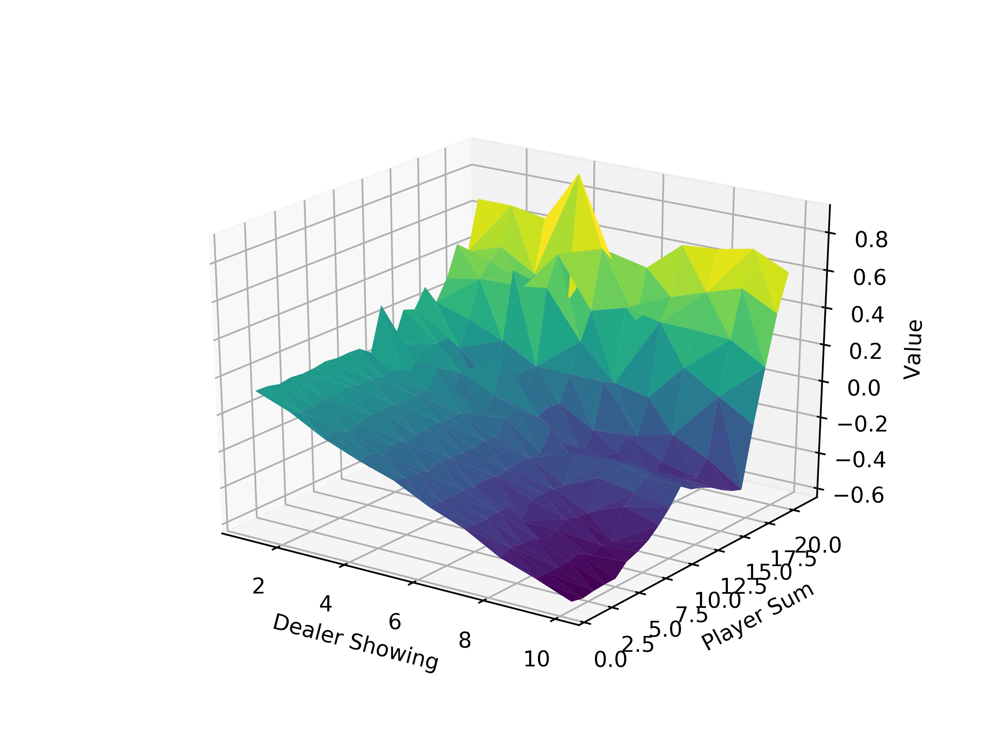

# easy21.rl
Solution to Reinforcement Learning Assignment: Easy21

### Q1: Easy21 Environment

```bash
$ python3 env.py
```

### Q2: Monte Carlo Control

```bash
$ python3 mc-control.py
```

Value function after 1 million episodes.

